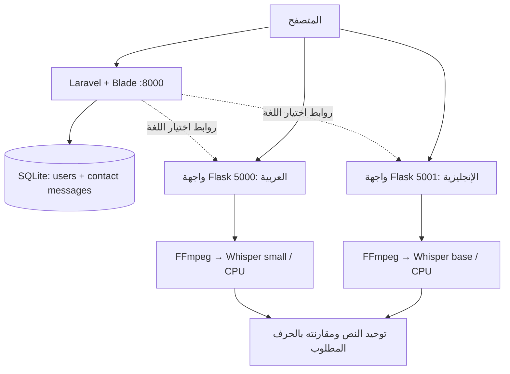

<div align="center">

# Thriving Together (Graduate Project)

### معًا ننمو — منصة لدعم النطق والتواصل

مشروع تخرج يجمع المحتوى العربي، والتمارين التفاعلية، وتجارب النطق بالعربية والإنجليزية في منصة واحدة.

**Laravel 12 · PHP · Blade · Flask · Whisper · SQLite**

[التثبيت والتشغيل](#التثبيت-والتشغيل) · [المعمارية](#المعمارية) · [الاختبارات](#الاختبارات) · [حل-المشكلات](#حل-المشكلات)

</div>

---

## عن المشروع

**Thriving Together** منصة تعليمية موجهة للأطفال وأولياء الأمور لدعم ممارسة مهارات النطق والتواصل. توفر صفحات توعوية، وتمارين مدعومة بالصور والصوت والفيديو، وتجربة لتسجيل نطق الحروف ومقارنة النص الذي يتعرف عليه نموذج Whisper بالحرف المطلوب.

تتكون النسخة الحالية من تطبيق ويب بـ **Laravel** وخدمتي **Flask** مستقلتين للنطق العربي والإنجليزي. اسم المجلد داخل هذا المستودع هو `Graduate Project`، وهو يحتوي على نسخة المشروع المحلي `G Project`.

> التمارين والنتائج أدوات تعليمية، وليست تشخيصًا طبيًا أو تقييمًا سريريًا لدقة النطق، ولا تستبدل تقييم أخصائي التخاطب.

## المميزات

- **واجهة عربية:** صفحات للمقالات والتوعية بحالات مرتبطة بالكلام والتواصل، مع تمارين ووسائط تعليمية.
- **تمارين واختبارات تفاعلية:** أسئلة مصورة وأنشطة إرشادية وتمارين لأعضاء النطق.
- **نطق بلغتين:** واجهتان للعربية والإنجليزية، مع تسجيل الصوت من المتصفح وعرض نتيجة المحاولة.
- **حسابات المستخدمين:** إنشاء حساب، تسجيل الدخول والخروج، وعرض الملف الشخصي وتعديله.
- **نموذج تواصل:** التحقق من المدخلات وحفظ الرسائل في قاعدة البيانات.
- **تنظيم واضح:** فصل التطبيق الحالي وخدمات النطق عن النماذج والنسخ القديمة المحفوظة في `legacy`.

## المعمارية



تخدم كل خدمة Flask واجهتها وطلبات الصوت من نفس العنوان. يُحمّل نموذج Whisper عند أول طلب يحتاجه، ثم يُعاد استخدامه. يحوّل FFmpeg التسجيل إلى صوت أحادي القناة بتردد 16 kHz قبل التفريغ النصي. النتيجة مقارنة نصية وليست درجة صوتية أو قياسًا لشدة اضطراب النطق.

## التقنيات

| الجزء | التقنيات المستخدمة |
| --- | --- |
| تطبيق الويب | PHP 8.2+، Laravel 12، Blade |
| قاعدة البيانات المحلية | SQLite؛ بيانات الحسابات في `yassdb` والرسائل في `contact_messages` |
| بناء الواجهة | Vite 6، Tailwind CSS 3، JavaScript وCSS |
| خدمات النطق | Python، Flask 3، OpenAI Whisper |
| معالجة الصوت | `imageio-ffmpeg` وNumPy |
| التحقق | PHPUnit، Python unittest، فحص الأصول وJavaScript |
| الملفات الكبيرة | Git LFS للفيديوهات |

## هيكل المشروع

```text
Graduate Project/
├── web/                           تطبيق Laravel الفعلي
│   ├── app/                       Controllers، Models، Middleware
│   ├── database/                  Migrations وFactories
│   ├── public/assets/             الصور والأصوات والفيديوهات
│   ├── resources/views/           صفحات Blade
│   ├── routes/web.php             مسارات الموقع
│   └── tests/                     اختبارات التطبيق
├── services/pronunciation/
│   ├── arabic/                    واجهة وAPI النطق العربي
│   ├── english/                   واجهة وAPI النطق الإنجليزي
│   ├── tests/                     اختبارات الخدمات ومعالجة الصوت
│   └── requirements.txt
├── tools/migrate_legacy_views.py   أداة تحويل المحتوى القديم إلى Blade
├── docs/audit-report.md            تقرير مراجعة سابق مؤرخ
├── legacy/                        مصادر قديمة؛ ليست جزءًا من التشغيل
├── start-local.cmd                تشغيل محلي على Windows بعد الإعداد
└── README.md
```

## التثبيت والتشغيل

الأوامر التالية لـ **PowerShell على Windows**. تحتاج Git وGit LFS، وPHP 8.2 أو أحدث مع امتداد PDO SQLite ومتطلبات Laravel، وComposer، وNode.js 20+ مع npm، وPython؛ يُنصح ببيئة Python 3.11 أو 3.12 للمشروع. يجب أن تكون أوامر `php` و`composer` و`node` و`npm` و`python` متاحة في `PATH`.

### 1. تنزيل المشروع والفيديوهات

بعد تثبيت Git LFS:

```powershell
git lfs install
git clone https://github.com/HaZem-Osama911/Projects.git
Set-Location "Projects/Graduate Project"
git lfs pull
```

استخدم Git مع LFS لضمان تنزيل ملفات الفيديو الفعلية. ملفات الفيديو النصية الصغيرة التي تبدأ بـ `version https://git-lfs.github.com/spec/v1` هي مؤشرات LFS وتحتاج `git lfs pull`.

### 2. إعداد تطبيق الويب

من جذر `Graduate Project`، عند التثبيت لأول مرة:

```powershell
Set-Location web
composer install
Copy-Item .env.example .env
php artisan key:generate
if (-not (Test-Path database/database.sqlite)) {
    New-Item -ItemType File database/database.sqlite | Out-Null
}
php artisan migrate
npm ci
npm run build
Set-Location ..
```

عند تحديث تثبيت موجود، احتفظ بملف `.env` ومفتاح التطبيق وقاعدة البيانات الخاصة بك. ملف `.env.example` يجهز SQLite محليًا؛ لا تحتاج إنشاء قاعدة MySQL للتجربة المحلية.

### 3. إعداد خدمات النطق

من جذر المشروع:

```powershell
Set-Location services/pronunciation
python -m venv .venv
.\.venv\Scripts\python.exe -m pip install -r requirements.txt
Set-Location ../..
```

أول محاولة نطق قد تستغرق وقتًا لتنزيل وتحميل نموذج `small` للعربية أو `base` للإنجليزية. يحتاج التنزيل اتصالًا بالإنترنت ومساحة تخزين كافية، وتعمل النماذج في الكود الحالي على CPU. يستخدم المشروع FFmpeg عبر حزمة `imageio-ffmpeg`.

### 4. تشغيل الخدمات

افتح ثلاث نوافذ PowerShell، وابدأ كل واحدة من جذر المشروع:

**الموقع:**

```powershell
Set-Location web
php artisan serve --host=127.0.0.1 --port=8000
```

**النطق العربي:**

```powershell
Set-Location services/pronunciation/arabic
..\.venv\Scripts\python.exe server.py
```

**النطق الإنجليزي:**

```powershell
Set-Location services/pronunciation/english
..\.venv\Scripts\python.exe server.py
```

| الخدمة | العنوان المحلي |
| --- | --- |
| الموقع | <http://127.0.0.1:8000> |
| النطق العربي | <http://127.0.0.1:5000> |
| النطق الإنجليزي | <http://127.0.0.1:5001> |
| فحص الخدمة العربية | <http://127.0.0.1:5000/health> |
| فحص الخدمة الإنجليزية | <http://127.0.0.1:5001/health> |

**اختصار Windows:** بعد الإعداد، يمكن تشغيل `start-local.cmd` لفتح الخدمات الثلاث. يفترض الملف وجود PHP في `C:\xampp\php\php.exe`؛ عدّل `PHP_EXE` داخله إذا كان مسارك مختلفًا. الأمر `.\start-local.cmd --check` يتحقق من وجود مساري PHP وPython فقط.

## الإعدادات

| المتغير | مكان الضبط | الغرض |
| --- | --- | --- |
| `APP_URL` | `web/.env` | عنوان الموقع |
| `DB_CONNECTION` | `web/.env` | `sqlite` للتطوير المحلي |
| `ARABIC_PRONUNCIATION_URL` | `web/.env` | رابط واجهة النطق العربي |
| `ENGLISH_PRONUNCIATION_URL` | `web/.env` | رابط واجهة النطق الإنجليزي |
| `PRONUNCIATION_HOST` | بيئة عملية Python | الافتراضي `127.0.0.1` |
| `PRONUNCIATION_PORT` | بيئة كل خدمة Python | `5000` للعربية و`5001` للإنجليزية |

على جهاز آخر، يجب أن تكون روابط خدمات النطق قابلة للوصول من متصفح المستخدم؛ `127.0.0.1` يشير إلى جهاز المستخدم نفسه. لا تقرأ خدمات Python ملف Laravel `.env` تلقائيًا.

## واجهة API للنطق

كلتا الخدمتين توفران `GET /health` و`POST /check_pronunciation`. الطلب الثاني يستخدم `multipart/form-data`:

| الحقل | المحتوى |
| --- | --- |
| `letter` | اسم الحرف العربي مثل `ألف`، أو حرف إنجليزي مثل `A` |
| `audio` | تسجيل بصيغة `wav` أو `mp3` أو `ogg` أو `flac` أو `m4a` أو `aac` أو `webm` |

حد الطلب 10 MiB. مثال لشكل النتيجة:

```json
{ "is_correct": true, "expected": "A", "spoken": "A" }
```

تعتمد النتيجة على النص الذي يتعرف عليه النموذج بعد توحيده. قد تؤثر الضوضاء وجودة التسجيل والتعرف على الحروف المنفردة في النتيجة. تحفظ الخدمة التسجيل باسم مؤقت وتحاول حذفه بعد المعالجة، بما فيها حالات الفشل.

## الاختبارات

من جذر المشروع، بعد تثبيت الاعتماديات:

```powershell
Set-Location web
php artisan test
npm run test:static
npm run build
Set-Location ../services/pronunciation
.\.venv\Scripts\python.exe -m unittest discover -s tests -v
```

اختبارات Python العادية تشمل التحقق من المدخلات، وحدود نشر الملفات، وحذف التسجيلات، وفك الصوت باستخدام FFmpeg. اختبار Whisper الحقيقي يُتخطى افتراضيًا؛ لتشغيله من `services/pronunciation`:

```powershell
$env:RUN_WHISPER_INTEGRATION = "1"
.\.venv\Scripts\python.exe -m unittest discover -s tests -p test_whisper_integration.py -v
Remove-Item Env:RUN_WHISPER_INTEGRATION
```

هذا الاختبار يتحقق من إمكانية تشغيل النموذجين، ولا يقيس دقة النطق سريريًا. [تقرير المراجعة السابق](docs/audit-report.md) يصف نتائج بتاريخ المراجعة المذكور فيه، وليس ضمانًا لحالة أي بيئة جديدة.

## حل المشكلات

| المشكلة | ما يجب التحقق منه |
| --- | --- |
| `php` أو `composer` غير معروف | تثبيت الأداة وإضافة مسارها إلى `PATH`؛ أو استخدام مسار PHP الكامل |
| خطأ `could not find driver` | تفعيل `pdo_sqlite` و`sqlite3` في إعدادات PHP المستخدمة من سطر الأوامر |
| خطأ مفتاح التطبيق | نسخ `.env.example` عند التثبيت الأول ثم تشغيل `php artisan key:generate` |
| خطأ Vite manifest | تشغيل `npm ci` ثم `npm run build` داخل `web` |
| الفيديو لا يعمل | تنفيذ `git lfs pull` والتحقق من أن الملف فيديو فعلي |
| رابط النطق لا يفتح | تشغيل خدمة اللغة ومطابقة المنفذ مع روابط `web/.env` |
| الميكروفون لا يعمل | السماح به للصفحة واستخدام localhost محليًا أو HTTPS عند النشر |
| أول محاولة نطق بطيئة | انتظار تنزيل وتحميل النموذج؛ المعالجة الحالية تعمل على CPU |

## ملاحظات النشر

- اجعل جذر موقع الويب يشير إلى **`web/public`**، مع إبقاء `legacy` خارج المسارات العامة.
- اضبط `APP_ENV=production` و`APP_DEBUG=false` وعناوين الخدمات وHTTPS وإعدادات الجلسات المناسبة.
- استخدم خادم WSGI مناسبًا لخدمات Flask بدل خادم التطوير، وجهز نماذج Whisper قبل التشغيل إذا لم يتوفر اتصال بالإنترنت.
- ملفات `.env` وقواعد البيانات المحلية والتسجيلات المرفوعة والاعتماديات وملفات البناء مستبعدة من Git؛ يعاد إنشاؤها أو تثبيتها حسب خطوات الإعداد.
- مجلد `legacy` مرجع تاريخي داخل النسخة المحلية الجديدة، وليس التطبيق الذي يجب تشغيله. تُستبعد مخلفات مساحة العمل القديمة وملف تثبيت Python من النسخة المنشورة.

## توثيق إضافي

- [دليل تطبيق Laravel](web/README.md)
- [دليل خدمات النطق](services/pronunciation/README.md)
- [تقرير التحليل والإصلاح السابق](docs/audit-report.md)
- [المحتوى القديم](legacy/README.md)

هذا المشروع يتضمن وسائط ومكتبات خارجية؛ راجع تراخيصها الأصلية قبل إعادة استخدامها أو توزيعها.
