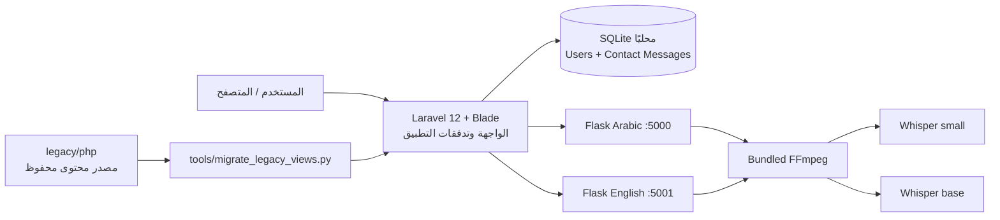

# تقرير تحليل وإصلاح مشروع Thriving Together

تاريخ المراجعة: 29 يوليو 2026

## الخلاصة التنفيذية

تم تحويل النسخة الفعالة من المشروع إلى تطبيق Laravel 12 قابل للتشغيل
والاختبار، مع الإبقاء على المحتوى القديم كمصدر محفوظ فقط. تم إصلاح أعطال
قاعدة البيانات والـ migrations والروابط والأصول والـ JavaScript، واستكمال
التسجيل والدخول والملف الشخصي ونموذج التواصل، وتأمين تطبيق Laravel وخدمتي
النطق. كما تم تشغيل Whisper الحقيقي للنموذجين العربي والإنجليزي بنجاح بعد
إزالة الاعتماد على تثبيت FFmpeg على نظام التشغيل.

نتيجة دورة التحقق النهائية: كل الاختبارات الآلية، بناء الإنتاج، فحص الصياغة،
فحص الأصول، اختبارات HTTP، وفحص ثغرات Composer وnpm نجحت.

## تنظيم مساحة العمل

أُزيلت سلسلة المجلدات العشوائية
`Project/last-one/last-one/graduate project` من مسار التشغيل. أصبح جذر
`G Project` يحتوي مباشرة على:

- `web` لتطبيق Laravel الفعلي.
- `services/pronunciation` لخدمتي العربي والإنجليزي.
- `tools` لأداة تحويل المحتوى القديم.
- `docs` للتوثيق والتقارير.
- `legacy` لكل النسخ والمواد غير الداخلة في الإنتاج.

تم كذلك توحيد أسماء ملفات اللغتين إلى `server.py`, `index.html`,
`test.html`, `letters.js`, و`speech_to_text.py`، وإصلاح imports والروابط
والاختبارات وبيئة Python بعد النقل. أضيف `start-local.cmd` لتشغيل المكونات
الثلاثة من جذر المشروع.

## المعمارية المعتمدة

### المكونات

- `web`: التطبيق الفعلي. يعرض صفحات Blade ويدير التسجيل والدخول
  والملف الشخصي ورسائل التواصل والمحتوى والاختبارات.
- `services/pronunciation/arabic`: واجهة وAPI نطق عربي على المنفذ 5000، بنموذج Whisper
  `small`.
- `services/pronunciation/english`: واجهة وAPI نطق إنجليزي على المنفذ 5001، بنموذج
  Whisper `base`.
- `legacy/php/frontend` و`legacy/php/backend`: النسخة القديمة محفوظة لاسترجاع المحتوى، وليست مسار
  التشغيل أو النشر.
- `tools/migrate_legacy_views.py`: تحويل قابل للتكرار من صفحات النسخة القديمة إلى Blade،
  مع نسخ الأصول الآمنة واستبعاد الملفات التنفيذية.
- `legacy/react-prototype`: قالب Create React App تجريبي غير مستخدم، وليس جزءًا من معمارية
  الإنتاج.

## تدفق البيانات

1. يعرض Laravel صفحات المحتوى والاختبارات من Blade.
2. التسجيل والدخول يمران عبر validation وCSRF، وتُخزن كلمات المرور hashed.
3. بيانات المستخدم ورسائل التواصل تُخزن في SQLite محليًا.
4. صفحة النطق توجه المستخدم إلى خدمة اللغة المطلوبة.
5. تستقبل Flask ملفًا صوتيًا بحد أقصى 10 MB، تتحقق من النوع والقيمة، وتمنحه
   اسم UUID مؤقتًا.
6. يحول FFmpeg المحمول التسجيل إلى mono PCM بمعدل 16 kHz، ثم يحلله Whisper.
7. تُطبع النتيجة، تُعاد كـ JSON، ثم يُحذف الملف المؤقت في جميع الحالات.

## المشاكل التي تم إصلاحها

### الباك إند وLaravel

- إصلاح migration غير صالح نحويًا كان يمنع إنشاء جدول المستخدمين.
- ترقية Laravel من نطاق الإصدار 11 المحجوب أمنيًا إلى Laravel 12.64.0، وإنشاء
  `composer.lock` ثابت.
- توليد `APP_KEY` صالح بدل القيمة الفارغة.
- استبدال اتصال MySQL المتوقف بـ SQLite جاهز محليًا وتشغيل migrations.
- استكمال التسجيل والدخول والخروج وتجديد الجلسة وخيار remember.
- إضافة validation موحد للبريد والهاتف وكلمة المرور، مع منع البريد المكرر
  وتحويل البريد إلى lowercase.
- إضافة rate limiting لمحاولات الدخول ونموذج التواصل.
- تنفيذ تخزين رسائل التواصل بدل endpoint PHP القديم.
- تنفيذ عرض وتعديل الملف الشخصي مع حماية `auth`.
- فصل صفحة النطق في Controller وتحويل الصفحات الثابتة إلى `Route::view` كي
  يعمل route caching في الإنتاج.
- تعطيل مسارات Laravel Storage المؤقتة غير المستخدمة، وتقليل سطح الهجوم من
  33 إلى 30 route.
- ضبط الاسم واللغة والمنطقة الزمنية وURL المحلي.
- معالجة تحذيرات Composer classmap الناتجة عن تثبيت source على بيئة لا تحتوي
  PHP Zip.

### الواجهة

- إعادة بناء layout موحد مع navigation وحالة المستخدم ورسائل النجاح والأخطاء
  وlogout آمن.
- تحويل 27 صفحة إلى Blade نظيف بدل تكرار مستندات HTML كاملة داخل بعضها.
- إصلاح تعبيرات `asset()` المهروبة، وروابط `.php` القديمة، وكل مراجع الأصول
  المفقودة.
- منع نسخ ملف تثبيت Python التنفيذي إلى مجلد `public`.
- إصلاح صور امتحان مفقودة وفيديوهات تشير إلى ملفات غير موجودة.
- إصلاح امتحان guided الذي كان يستخدم السؤال الرابع بدون قراءته، وتصحيح وصف
  عدد الأسئلة.
- إضافة منطق صفحة التشخيص المفقود: filters، progress، validation، وإظهار
  التمارين.
- إزالة مراجع Bootstrap/Animate/Font Awesome المفقودة من واجهة النطق
  الإنجليزية، واستبدال الحركة والتنسيق بما يلزم داخل CSS المحلي.
- استخدام `textContent` وescaping في المواضع الديناميكية بدل حقن HTML.
- إضافة تنبيه واضح أن الاختبارات تعليمية وليست تشخيصًا طبيًا.
- إضافة فحص ثابت قابل للتكرار عبر `npm run test:static`.

### خدمات النطق والذكاء الاصطناعي

- منع Flask من نشر مجلد الخدمة بالكامل؛ ملفات Python والسجلات والتسجيلات
  ومصادر النماذج لم تعد قابلة للوصول عبر HTTP.
- قصر الأصول العامة على CSS/JS والخطوط والأصوات المطلوبة فقط.
- إصلاح خطأ `UnboundLocalError` عند فشل validation قبل إنشاء الملف المؤقت.
- منع path traversal باستخدام أسماء UUID مولدة على الخادم.
- حذف التسجيل المؤقت دائمًا، بما في ذلك حالات الفشل.
- إضافة حد رفع 10 MB والتحقق من الامتداد وقيمة الحرف.
- قصر القيم العربية على أسماء الحروف الـ28، وإيقاف الطلب عند فتح التمرين بلا
  حرف صالح.
- إغلاق مسارات الميكروفون بعد انتهاء كل محاولة بدل ترك مؤشر التسجيل فعالًا.
- إيقاف debug افتراضيًا والربط على `127.0.0.1`.
- تحويل طلبات الواجهة إلى same-origin بدل عناوين hard-coded.
- تحميل نموذج Whisper عند أول طلب فقط حتى يبدأ health endpoint بسرعة.
- توحيد النص المتوقع والمنطوق قبل المقارنة.
- إضافة `imageio-ffmpeg` وdecoder داخلي، لذلك لا يحتاج المشروع FFmpeg مثبتًا
  على النظام.

### الأمان والتشغيل

- إضافة headers: `X-Content-Type-Options`, `X-Frame-Options`,
  `Referrer-Policy`, و`Permissions-Policy`.
- إضافة CSP وheaders مماثلة لخدمتي Flask، مع السماح بالميكروفون لنفس origin
  فقط.
- الحفاظ على CSRF في النماذج وتدوير الجلسة بعد المصادقة.
- عدم نشر `.env` أو SQLite أو vendor أو node_modules أو بيئة Python.
- فحص Composer وnpm: لا توجد advisories معروفة وقت المراجعة.
- توثيق أن document root في الإنتاج يجب أن يكون `web/public` فقط.

## أدلة التحقق

| الفحص | النتيجة |
|---|---:|
| Laravel PHPUnit | 8 ناجحة، 246 assertions |
| Python API/audio tests | 8 ناجحة، واختبار التكامل الثقيل skipped افتراضيًا |
| Whisper real-model integration | اختبار واحد ناجح للنموذجين `small` و`base` |
| HTTP Laravel smoke test | 27 صفحة/أصل، كلها 200 |
| Flask live smoke test | 9 endpoints/assets، كلها 200 |
| Blade/static audit | 27 view و6 صفحات AI، و201 Laravel asset reference بدون مفقود |
| JavaScript audit | 8 ملفات و18 inline script بدون syntax errors |
| PHP lint | كل ملفات PHP نجحت |
| Laravel Pint | ناجح |
| Laravel optimize/cache | config وevents وroutes وviews نجحت |
| Vite production build | ناجح |
| Composer audit | لا توجد ثغرات معروفة |
| npm audit | 0 vulnerabilities |
| pip check | لا توجد dependencies مكسورة |

## أوامر التشغيل

راجع `web/README.md` و`services/pronunciation/README.md` للتثبيت والتشغيل
والاختبار. ترتيب التشغيل المحلي هو:

1. تشغيل Laravel على `http://localhost:8000`.
2. تشغيل خدمة العربي على `http://127.0.0.1:5000`.
3. تشغيل خدمة الإنجليزي على `http://127.0.0.1:5001`.

## قرارات متبقية قبل النشر

هذه ليست أخطاء برمجية متروكة، لكنها قرارات تخص بيئة الإنتاج أو ملكية البيانات:

- يوجد 136 تسجيلًا قديمًا في `services/pronunciation/arabic/uploads` وتسجيل واحد في
  `services/pronunciation/english/uploads`. تم منع الوصول لها عبر HTTP واستبعاد uploads من Git،
  لكن لم تُحذف لأنها قد تكون بيانات مستخدمين. يجب تحديد سياسة retention
  والحصول على إذن قبل حذفها.
- أول تشغيل على خادم جديد يحتاج تنزيل نموذجي Whisper `small` و`base` مسبقًا
  إذا كانت بيئة الإنتاج بلا اتصال بالإنترنت.
- في الإنتاج يجب ضبط `APP_ENV=production` و`APP_DEBUG=false` وHTTPS وsecure
  cookies، واستخدام عملية WSGI مناسبة بدل خادم Flask التطويري.
- تعذر تشغيل أداة المتصفح المرئي في بيئة المراجعة بسبب خطأ صلاحيات
  `EPERM` داخل مجلد AppData. تم التعويض باختبارات render وHTTP والأصول
  والـ JavaScript، لكن يظل فحص بصري يدوي لمقاسات الهاتف وسماح الميكروفون خطوة
  قبول نهائية مستحسنة.
- القالب `legacy/react-prototype` والنسخة القديمة لم يُحذفا لتجنب فقدان محتوى بدون قرار من
  صاحب المشروع؛ يجب ألا يدخلا في حزمة النشر.
