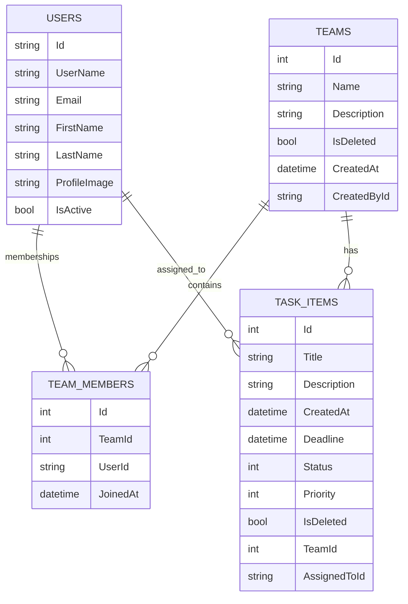

# MegaSoft – مشروع إدارة Teams & Tasks (دليل شامل للتشغيل + الفهم + الإضافة)

## 1) فكرة المشروع بسرعة
`MegaSoft` هو تطبيق **ASP.NET Core MVC** مبني على **.NET 10** يوفّر:
- **Identity** لتسجيل الدخول وإدارة الصلاحيات (Roles).
- إدارة **Teams** + أعضاء الفريق (TeamMembers).
- إدارة **Tasks** وربطها بفريق، وإسنادها لمستخدم.
- واجهات **Razor Views** بتصميم حديث (Bootstrap + CSS مخصص في `wwwroot/css/site.css`).

> ملاحظة: المشروع يستخدم .NET 10 (Preview) في جهازك. ده مناسب للتطوير/التجربة، لكن في التسليم للشركات غالبًا يفضّل نسخة LTS حسب سياسة الشركة.

---

## 2) المتطلبات (Requirements)
- **.NET SDK** (المشروع حالياً `net10.0`)
- **SQL Server** (أو LocalDB)
- (اختياري) **EF Core Tools** لو هتتعامل مع migrations من CLI

---

## 3) تشغيل المشروع من الصفر (Step-by-step)
### 3.1) إعداد قاعدة البيانات
اتأكد من `ConnectionStrings:DefaultConnection` في:
- `MegaSoft/appsettings.json`

ثم طبّق migrations:

```bash
dotnet ef database update
```

> لو مش عندك `dotnet-ef`:

```bash
dotnet tool install --global dotnet-ef
```

### 3.2) تشغيل المشروع
من مجلد المشروع:

```bash
dotnet run
```

أو تحديد URL:

```bash
dotnet run --urls http://localhost:5055
```

---

## 4) هيكل المشروع (Structure)
أهم المجلدات:
- `MegaSoft/Program.cs`: DI + Middleware + Routing.
- `MegaSoft/Data/ApplicationDbContext.cs`: DbContext + علاقات EF + تعديل أسماء جداول Identity.
- `MegaSoft/Models/*`: الكيانات الأساسية (Team/TaskItems/ApplicationUser/TeamMember).
- `MegaSoft/Repositories/*`: Data access (استعلامات + CRUD).
- `MegaSoft/Services/*`: Business logic (قواعد شغل أعلى من الريبو).
- `MegaSoft/Controllers/*`: Endpoints MVC (Actions).
- `MegaSoft/Views/*`: واجهات Razor.
- `MegaSoft/wwwroot/css/site.css`: تصميم الموقع الأساسي + Utilities.

---

## 5) المعمارية (Architecture) – ازاي الطلب بيتنفّذ؟
### 5.1) الفكرة
المشروع ماشي بنمط طبقات بسيط:

**Controller → Service → Repository → DbContext → Database**

### 5.2) ليه بنعمل كده؟
- **Repository**: يركّز على EF/SQL والاستعلامات والـIncludes.
- **Service**: يركّز على قواعد الشغل (Business rules) وتجميع الداتا.
- **Controller**: يركّز على HTTP/MVC (ModelState, Redirect/View, Authorization).

### 5.3) مثال flow من الموجود
#### Teams Dashboard
- `TeamController.Team_Dashboard()`:
  - يحدد `userId/role`.
  - ينادي `ITeamService.GetTeamsForUserAsync()`.
  - يحول Teams لـViewModel مناسب للعرض.

#### Tasks Dashboard
- `TaskController.Task_Dashboard()`:
  - لو Admin/Manager: كل التاسكات
  - لو Technical Head: تاسكات الـTeams اللي هو عضو فيها
  - لو Employee: تاسكات المسندة له

---

## 6) شرح قاعدة البيانات (Database) + العلاقات
### 6.1) الجداول الأساسية
- `Teams`
- `TeamMembers` (جدول ربط many-to-many بين Teams و Users)
- `TaskItems` (تاسكات مرتبطة بفريق + AssignedTo اختياري)

### 6.2) Identity Tables
Identity tables تم تغيير أسمائها وSchema في `ApplicationDbContext`:
- Users/Roles/... تحت Schema: **Security**
  - مثال: `Security.Users`, `Security.Roles`

### 6.3) Soft Delete
- `Teams.IsDeleted`
- `TaskItems.IsDeleted`

الاستعلامات في Repositories بتفلتر `IsDeleted = false`.

---

## 7) ERD (Entity Relationship Diagram)
> ده رسم مبسط يوضح العلاقات الأساسية.



### 7.1) ملاحظات على العلاقات
- TeamMembers:
  - فيه Unique Index على `(TeamId, UserId)` لمنع تكرار العضوية.
- TaskItems:
  - لازم `TeamId` (Required).
  - `AssignedToId` ممكن يكون null.

---

## 8) الصلاحيات (Authorization) وRoles
المشروع يعتمد على:
- `[Authorize(Roles="...")]` على الـControllers.
- عرض Links في `_Layout.cshtml` حسب الـRole.

Roles المستخدمة:
- `ADMIN`
- `MANAGER`
- `TECHNICAL_HEAD`
- `EMPLOYEE`

---

## 9) إنشاء حسابات تلقائيًا (Seeding Users/Roles) – Dev فقط
تم إضافة Seeder: `MegaSoft/Data/IdentitySeeder.cs`
- بيعمل Roles
- بيعمل Admin
- بيعمل 5 Employees
- **Idempotent**: لو اليوزر موجود مش بيكرر إنشاءه

### 9.1) مهم جدًا: لا تضع كلمات المرور داخل الكود أو `appsettings.json`
استخدم **User Secrets** أثناء التطوير.

مثال إعداد الـSecrets (غير مثال الباسورد الحقيقي):

```bash
dotnet user-secrets set "Seed:Enabled" "true"
dotnet user-secrets set "Seed:AdminEmail" "admin@example.com"
dotnet user-secrets set "Seed:AdminPassword" "<YOUR_PASSWORD>"
dotnet user-secrets set "Seed:EmployeeEmailPrefix" "test"
dotnet user-secrets set "Seed:EmployeeEmailDomain" "gmail.com"
dotnet user-secrets set "Seed:EmployeeCount" "5"
dotnet user-secrets set "Seed:EmployeePassword" "<YOUR_PASSWORD>"
```

> لو عايز توقف الـseed:

```bash
dotnet user-secrets set "Seed:Enabled" "false"
```

---

## 10) “Recipe” عام لإضافة Feature جديدة (Backend كامل)
ده القالب اللي تشتغل بيه في أي فيتشر:

### 10.1) 1) Models (لو فيه جدول/كيان جديد)
- أنشئ Class في `Models/`.
- حدّد الـproperties + DataAnnotations (Required/MaxLength...).
- أضف Navigation properties لو فيه علاقات.

### 10.2) 2) DbContext
- أضف `DbSet<YourEntity>` في `ApplicationDbContext`.
- لو فيه علاقات/قيود: أضفها في `OnModelCreating`.

### 10.3) 3) Migration

```bash
dotnet ef migrations add AddYourFeature
dotnet ef database update
```

### 10.4) 4) Repository
1) أنشئ Interface في `Repositories/Interfaces` (مثال: `ICommentRepository`)
2) أنشئ Implementation في `Repositories/Implementations`
3) حط فيه:
   - `Get...Async` مع Includes
   - `CreateAsync`, `UpdateAsync`, `DeleteAsync`
   - التزام بالـsoft delete لو محتاج

### 10.5) 5) Service
1) Interface في `Services/Interfaces`
2) Implementation في `Services/Implementations`
3) حط قواعد الشغل:
   - Validation أعلى من الريبو
   - Permissions/Ownership checks (لو مناسبة)
   - تجميع نتائج من أكتر من repo

### 10.6) 6) DI Registration
سجّل الريبو والسيرفيس في `Program.cs`:

```csharp
builder.Services.AddScoped<IYourRepo, YourRepo>();
builder.Services.AddScoped<IYourService, YourService>();
```

### 10.7) 7) Controller + Views
- أضف Actions:
  - GET للعرض
  - POST للحفظ مع `ValidateAntiForgeryToken`
- Views في `Views/<ControllerName>/`
  - أعلى الصفحة: `@model ...`
  - لو محتاج dropdowns: استخدم `ViewBag` أو ViewModel قوي
  - استخدم نفس design system: `glass-card`, `btn-modern`, `table`

---

## 11) 5+ أمثلة Features جديدة (خطوات تنفيذ بالتفصيل)

### Feature 1: إسناد Task لموظف (Assign Task to Member)
**الهدف**: Admin/Manager يقدر يحدد `AssignedToId` بدل ما تكون تلقائيًا المستخدم الحالي.
- **Model**: مفيش تغيير (موجود `AssignedToId`).
- **Repository**: في `TaskRebository.UpdateAsync`:
  - أضف تحديث `AssignedToId` (حاليًا مش بيتحدّث).
- **Service**: في `TaskService.UpdateTaskAsync`:
  - ممكن تضيف Validation: المستخدم لازم يكون عضو في نفس Team.
- **Controller**:
  - في `Edit_Task GET`: جهّز `ViewBag.Users` حسب أعضاء الفريق.
  - في `Edit_Task POST`: اعمل binding لـAssignedToId.
- **View** (`Edit_Task.cshtml`):
  - أضف dropdown:
    - `asp-for="AssignedToId"`
    - `asp-items="ViewBag.Users"`

### Feature 2: Comments على Task
**الهدف**: كل Task يكون لها تعليقات من أعضاء الفريق.
- **Model**:
  - `TaskComment { Id, TaskId, UserId, Body, CreatedAt }`
- **DbContext**:
  - `DbSet<TaskComment>`
  - علاقة: TaskItems 1..N Comments
- **Migration**: `AddTaskComments`
- **Repository**:
  - `GetByTaskIdAsync(taskId)` مع include user
  - `CreateAsync(comment)`
- **Service**:
  - تحقق أن المعلق عضو في نفس Team
- **Controller**:
  - Action `PostComment(taskId, body)`
- **Views**:
  - في `Details_Task`: section comments + form إضافة تعليق

### Feature 3: Attachments (رفع ملفات على Task)
**الهدف**: رفع ملف (أو عدة ملفات) للتاسك.
- **Model**:
  - `TaskAttachment { Id, TaskId, FileName, StoredPath, Size, UploadedAt, UploadedById }`
- **Config**:
  - مجلد تخزين داخل `wwwroot/uploads/tasks/`
  - التزم بحد الحجم (موجود 10MB).
- **Repository/Service**:
  - create attachment record
  - validation للنوع والحجم
- **Controller**:
  - POST `UploadAttachment(IFormFile file, int taskId)`
- **View**:
  - في `Details_Task`: upload form + جدول attachments

### Feature 4: فلترة/بحث + Pagination في الداشبورد
**الهدف**: Task_Dashboard يبقى أسرع وأسهل مع بيانات كثيرة.
- **Repository**:
  - أضف `GetFilteredAsync(teamId?, status?, priority?, search?, page, pageSize)`
- **Service**:
  - يطبق قواعد صلاحيات المستخدم على الاستعلام
- **Controller**:
  - يقرأ query string parameters ويبعث ViewModel فيه:
    - Items + TotalCount + Page + PageSize + Filters
- **View**:
  - form filters أعلى الجدول
  - pagination footer

### Feature 5: Audit Log (تسجيل عمليات)
**الهدف**: حفظ من عمل Create/Edit/Delete.
- **Model**:
  - `AuditLog { Id, UserId, Action, Entity, EntityId, CreatedAt, DetailsJson }`
- **Service**:
  - بعد كل تغيير مهم (team/task/role) سجّل log
- **Admin View**:
  - صفحة `Admin/Audit` تعرض آخر 500 عملية مع فلترة

### Feature 6 (زيادة): Team Roles داخل الفريق
**الهدف**: يبقى فيه Role داخل الفريق (Lead/Member) غير Role النظام.
- **Model**:
  - أضف `TeamMember.RoleInTeam`
- **UI**:
  - في `Edit_Team` checkbox + dropdown role لكل عضو
- **Logic**:
  - constraints: team لازم له Lead واحد

---

## 12) Frontend / UI – Bootstrap + CSS
### 12.1) Bootstrap ليه مهم؟
Bootstrap بيقدّم:
- Grid system (`container`, `row`, `col-*`)
- Components جاهزة (Cards/Buttons/Alerts/Tables)
- Responsive utilities

المشروع بيستخدم Bootstrap مع CSS مخصص يعطي “الهوية”:
- `glass-card`: كروت شفافة حديثة
- `btn-modern`: أزرار gradient
- `animate-fadeIn`: أنيميشن دخول

### 12.2) ملف `site.css` – أهم الأجزاء
مقسّم أقسام:
- **Variables**: ألوان وخلفيات (`:root`)
- **Navbar**: `ultra-modern-navbar`, `nav-link-modern`
- **Cards**: `glass-card`, `stats-card`
- **Forms**: `.form-control` على خلفية غامقة
- **Buttons**: `.btn-modern` + gradients
- **Details Pages**: `.details-page` (منقول من inline styles)
- **Utilities**: classes صغيرة بديلة عن inline styles (زي `anim-delay-100`, `avatar-60`, `mw-250`…)

### 12.3) ازاي Table بيتعمل؟
في الـViews:
- جدول Bootstrap: `<table class="table align-middle">`
- header style عبر `.table thead th` في `site.css`
- wrapper container غالبًا:
  - `div.table-container` + `div.table-responsive`

لو هتعمل جدول جديد:
1) اعمل structure ثابت:
   - `table-responsive` لتمرير أفقي في الموبايل
2) استخدم badges للأعمدة status/priority
3) استخدم `btn btn-sm btn-modern` للأكشنز

---

## 13) Troubleshooting (أشهر مشاكل)
- **ملف exe متقفل** أثناء `dotnet run`:
  - اقفل أي instance شغالة أو اعمل kill للـprocess.
- **مشكلة DB / Migration**:
  - تأكد من connection string
  - جرّب `dotnet ef database update`
- **User/Role مش ظاهر**:
  - تأكد seeding enabled في user-secrets

---

## 14) Checklist قبل تسليم المشروع للشركة
- [ ] نقل المشروع لنسخة .NET مدعومة حسب سياسة الشركة (لو مطلوب)
- [ ] إزالة أي بيانات حساسة من secrets/docs
- [ ] تشغيل migrations على بيئة الشركة
- [ ] التأكد من Roles الأساسية موجودة
- [ ] توثيق أي إعدادات إضافية (SMTP/Storage) لو اتضافت لاحقًا

